# Webflix

Webflix est un projet qui va nous permettre de mettre en pratique le PHP de manière avancé (avec notamment la POO et le MVC). Pour mettre en place les bonnes pratiques, nous allons utiliser le framework Laravel car il est très abordable pour les débutants et permet de découvrir l'objet de manière simple et concrète.

Pour mieux nous aider, nous allons nous aider de ressources :

- https://courses.boxydev.com/laravel/
- https://laravel.com/docs/9.x

## PHP 8

Avant de commencer, il faudra s'assurer d'utiliser PHP 8. Sur MAMP, c'est facile, vous avez juste à switcher de version dans l'interface. Pour Laragon, il va falloir télécharger PHP 8 [ici](https://windows.php.net/downloads/qa/php-8.0.16RC1-Win32-vs16-x64.zip).

Il faudra décompresser le zip. On va ensuite déplacer le dossier dans `C:\laragon\bin\php`. On va pouvoir maintenant faire un clic droit sur Laragon et on devrait pouvoir utiliser la version 8 de PHP.

On va sûrement avoir une erreur avec Apache. On ira donc dans `C:\laragon\etc\apache2` modifier le fichier `mod_php.conf`. On doit simplement changer `php8_module` par `php_module`.

Sinon vous pouvez suivre cette [vidéo](https://www.youtube.com/watch?v=QHCkK8Mrw4w). On stop et on lance Laragon.

## Installer Composer

Il nous faut [Composer](https://courses.boxydev.com/php/composer) pour pouvoir installer des projets Laravel.

## Créer un projet Laravel

On peut maintenant [créer un projet Laravel](https://courses.boxydev.com/laravel/installation.html) avec Composer.

## Configurer le projet

Laissons-nous le temps de découvrir Laravel et surtout configurer la base de données du projet. Il faudra le faire au niveau du fichier `.env`.

## Workflow du projet

Pour travailler avec un framework, il y a certains processus à respecter. Tout d'abord, nous travaillons la plupart du temps avec Git et ce projet sera sur Github. Quand un développeur veut récupérer le projet pour travailler dessus, il doit cloner le projet dans un répertoire de travail :

```bash
git clone git@github.com:PSEUDO/DEPOT.GIT
```

Il est ensuite très important d'installer les dépendances `Composer` si le dossier `vendor` n'existe pas :

```bash
# Installe les dépendances
composer install
```

Si vous récupérez le projet Laravel pour la première fois, il ne faut pas oublier de configurer le fichier `.env` avec une clé de sécurité :

```bash
# Crée le fichier .env
php -r "file_exists('.env') || copy('.env.example', '.env');"
# Génére une clé pour l'application Laravel
php artisan key:generate
```

Régulièrement, il faudra pousser des commits de notre avancement sur Git.

## Architecture MVC

Après avoir fait un petit tour sur l'architecture de Laravel, on va essayer de [comprendre le MVC](https://courses.boxydev.com/php/architecture-mvc) en théorie puis l'appliquer avec le projet qui suit.

## Frontend, inscription et authentification

Pour intégrer très rapidement le front end et un système d'authentification, on peut installer le package [Laravel UI](https://github.com/laravel/ui). On aura donc un Bootstrap déjà configuré avec un login / inscription et mot de passe oublié. C'est incroyable !

Je précise que vous n'êtes pas du tout obligé d'utiliser ce package. Si vous vous sentez l'âme de tout faire de zéro, vous le pouvez grâce à la documentation et un peu de temps. Il existe également Laravel Breeze et Jetstream.

```bash
composer require laravel/ui
php artisan ui bootstrap --auth
npm install
npm run dev
```

Pour pouvoir tester le mot de passe oublié, on pourra configurer https://maildev.github.io/maildev/

## La page d'accueil

Pour commencer très simple, nous allons modifier la page d'accueil afin d'utiliser le layout de base que nous fournit Laravel UI avec Bootstrap. On pourrait bien entendu créer notre propre layout pour l'apprentissage.

On fera bien attention, nous avons 2 pages d'accueil, une pour les utilisateurs connectés et une autre accessible par tout le monde. On pourra se servir de la page d'accueil générée par Laravel pour faire une page de profil utilisateur.

## TP : Créer une page A propos

- Créer une nouvelle route `/a-propos`.
- Créer une vue associée à cette route.
- Renvoyer la vue au niveau de la route.
- Ajouter un lien dans le menu et tester la route.
- Passer un nom à la vue et un tableau représentant l'équipe de développement du site
- Afficher le nom et le tableau (@foreach) dans la vue
- Créer un contrôleur `AboutController` et ranger la logique dans cette classe
- Créer une nouvelle route `/a-propos/{user}` où `user` est n'importe quelle valeur
- Cette route doit être associée à une nouvelle méthode dans `AboutController`
- Créer une nouvelle vue associée à cette route et afficher la valeur sur la page.

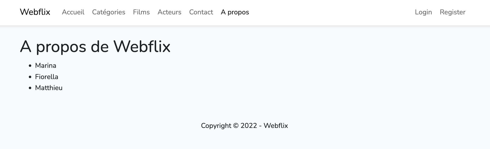

## La base de données

Nous allons commencer par créer les migrations nécessaires pour le projet, c'est-à-dire les tables et les relations entre elles.

    categories
        id - integer
        name - string

    movies
        id - integer
        title - string
        synopsys - text
        duration - integer
        youtube - string - nullable
        cover - string
        released_at - date - nullable
        category_id - integer - nullable
        user_id - integer - nullable

    actors
        id - integer
        name - string
        avatar - string - nullable
        birthday - date - nullable

    actor_movie
        actor_id - integer
        movie_id - integer

    comments
        id - integer
        message - text
        note - integer
        movie_id - integer
        user_id - integer - nullable

On va créer ensemble `categories` et `movies`. Nous créerons ensuite `actor_movie`. Si une migration ne nous convient pas, on peut la supprimer et la recréer.

## TP : Migration

Créer les migrations des tables `actors` et `comments`. N'oubliez pas de lancer la commande pour exécuter les migrations et vérifiez que les tables soient bien créées dans PhpMyAdmin.

## Le modèle Category

Chaque table de la base de données se verra attribuer un modèle (une classe PHP). Cette classe va nous servir à manipuler facilement la base de données. On va créer une route afin de créer un modèle en exemple et une autre route permettant de lister les catégories.

## TP : Créer le modèle Movie

Je vous laisse créer le modèle Movie. Vous allez créer deux routes :

- /exercice/films -> Vous utiliserez simplement le modèle pour afficher tous les films
- /exercice/film/{id} -> Vous utiliserez simplement le modèle pour afficher le film qui a l'id présent dans l'URL

## Les factories et les seeders

Afin de remplir très rapidement notre base de données, nous allons pouvoir créer un `seeder`. Dans le `seeder`, nous allons pouvoir utiliser plusieurs `factories` afin de générer de nombreuses données. Une `factory` a pour seul objectif de créer des modèles. Imaginez une `factory` comme une usine (puisque c'est sa signification).

Nous allons créer la `factory` des catégories. On va essayer d'utiliser [Faker](https://fakerphp.github.io) pour créer de fausses catégories.

## TP : Seeder

- Modifier le seeder pour ajouter 20 films dans la base de données. Vous utiliserez Faker pour remplir les champs.

## Les catégories (Contrôleur et Vue)

Nous allons créer la partie gestion des catégories. Il nous faut ce qu'on appelle des routes :

- GET /categories va nous permettre d'afficher toutes les catégories
- GET /categories/creer va nous permettre d'afficher un formulaire pour ajouter une catégorie
- POST /categories va nous permettre de traiter le formulaire pour ajouter une catégorie
- GET /categories/{category} va nous permettre de voir le détail d'une catégorie
- GET /categories/{category}/modifier va nous permettre d'afficher un formulaire pour modifier une catégorie
- PUT /categories/{category} va nous permettre de modifier une catégorie
- DELETE /categories/{category} va nous permettre de supprimer une catégorie

Pour gérer tout cela plus simplement, nous allons créer un contrôleur ensemble.

## API The Movie DB

Afin que le projet soit plus intéressant, on va essayer de récupèrer des données provenant de l'API [The Movie DB](https://www.themoviedb.org). On va essayer d'aller chercher les catégories sur l'API [The Movie DB](https://www.themoviedb.org). On va donc modifier le seeder afin que les données soient plus réalistes.

## (TP) : API

- Utiliser la facade Http de Laravel pour aller chercher les films populaires sur l'API (https://api.themoviedb.org/3/movie/popular).
- On en profitera également pour ajouter les acteurs.

## TP : Les films et les acteurs

Nous allons créer plusieurs routes afin de gérer les films et les acteurs :

- GET /films va nous permettre d'afficher tous les films
- GET /films/{movie} va nous permettre de voir le détail d'un film
- GET /acteurs va nous permettre d'afficher tous les acteurs
- GET /acteurs/{actor} va nous permettre de voir le détail d'un acteur

Sur le détail d'un film, on pourra cliquer sur un bouton qui ouvrira une modal Bootstrap affichant la bande annonce sur Youtube.

Sur le détail d'un acteur, on affichera son âge grâce à la date de naissance, on peut le faire facilement grâce à Carbon dans Laravel et le `cast` de `birthday`.


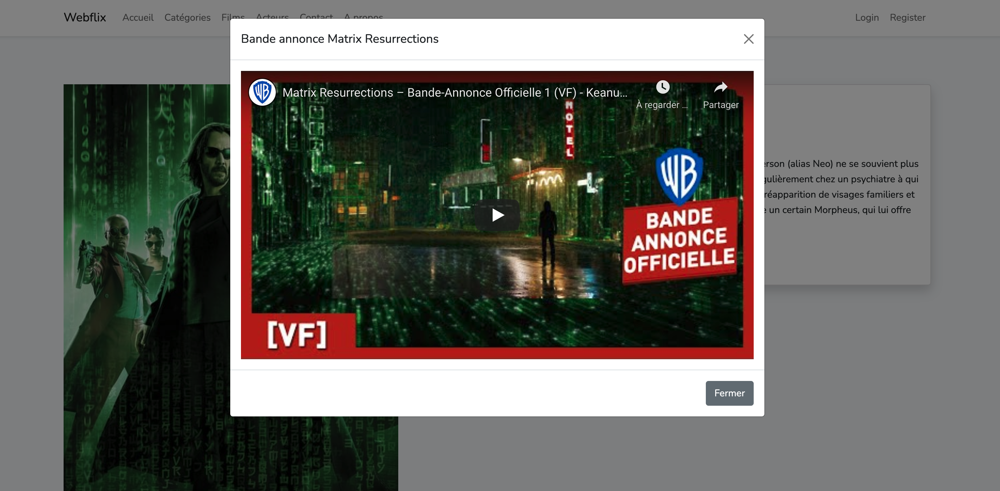
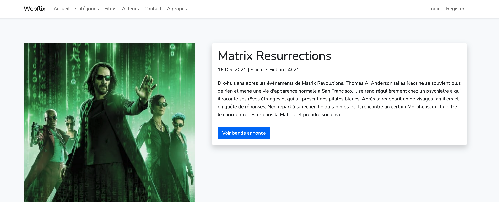

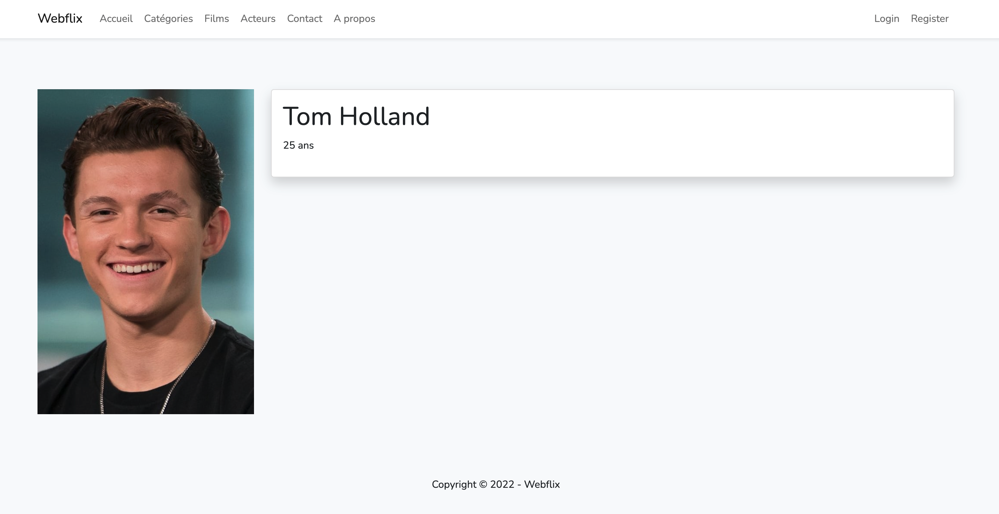

## Gestion des acteurs

Nous allons nous occuper de la partie pour gérer les acteurs, c'est-à-dire de pouvoir créer / modifier ou supprimer un acteur.

- GET /acteurs/creer va nous permettre d'afficher un formulaire pour ajouter un acteur
- POST /acteurs va nous permettre de traiter le formulaire pour ajouter un acteur
- GET /acteurs/{actor}/modifier va nous permettre d'afficher un formulaire pour modifier un acteur
- PUT /acteurs/{actor} va nous permettre de modifier un acteur
- DELETE /acteurs/{actor} va nous permettre de supprimer un acteur

## TP : Gestion des films

Je vais vous laisser faire la même chose pour la gestion des films. Le select des catégories devra afficher toutes les catégories de la BDD, la value doit contenir l'id de la catégorie.

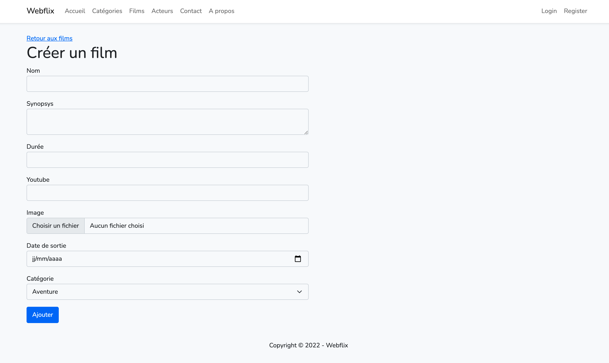

## Relations entre les modèles

Pour afficher les films d'une catégorie ou afficher la catégorie d'un film, on aura besoin de jeter un oeil sur la partie relations entre les tables.

## TP : Relation Many To Many

En vous aidant de la documentation de Laravel, vous allez déclarer une relation Many To Many entre les acteurs et les films. Vous afficherez donc la liste des acteurs sur le détail d'un film et la liste des films d'un acteur sur le détail de celui-ci. On pourra cliquer sur un acteur ou un film.

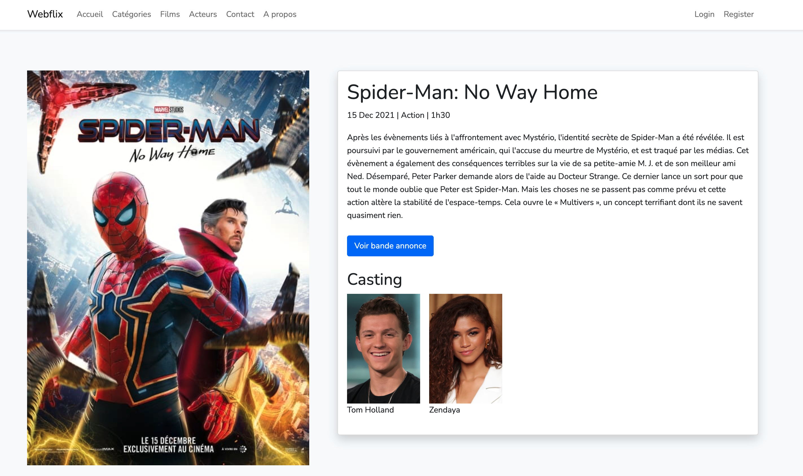
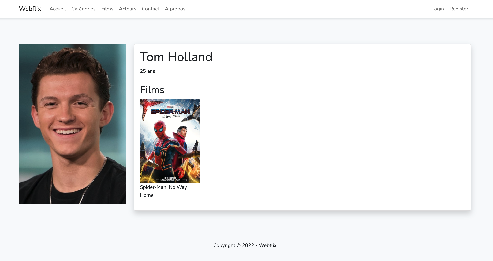

## Debug bar

On peut installer ce package https://github.com/barryvdh/laravel-debugbar afin d'avoir une debug bar dans notre projet. Cela va nous aider à debugger, voir si on peut optimiser nos requêtes SQL par exemple. Cela nous permettra de comprendre le problème N+1 avec un ORM.

## TP : Les commentaires

Vous allez réaliser seul la partie commentaire. La première chose à faire va être de s'assurer qu'on a bien la migration et que la table `comments` existe dans votre BDD. Optionnellement, vous pouvez créer des commentaires de manière rapide grâce au seeder (sans api, avec du lorem ipsum de faker).

On va ajouter un formulaire d'ajout directement sur la page détail d'un film :

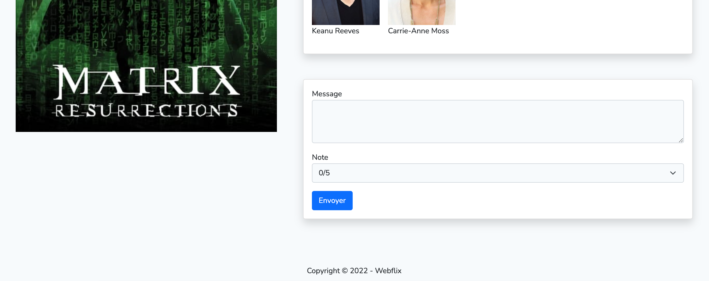

On n'oubliera pas le code Blade `@csrf` pour avoir la protection Csrf sur le formulaire. L'action du formulaire ira vers une route nommée `comments.store`. Il faudra créer cette route et l'associer à une action d'un nouveau contrôleur `CommentController`. La route aura besoin du film dans l'URL. On va définir la méthode `store()` sur celui-ci. On aura sûrement besoin d'utiliser le binding sur la route pour récupèrer le film de l'URL.

On validera bien la requête (message de 5 caractères minimum et une note de 0 à 5). Si la requête n'est pas valide, on affiche les erreurs. Sinon, on ajoutera le commentaire dans la base de données, on pourra utiliser la méthode `create()` du modèle ou alors on pourra définir une relation One To Many et utiliser [cela](https://laravel.com/docs/9.x/eloquent-relationships#the-create-method). Attention de bien définir les champs `fillable`. Si l'utilisateur est connecté on le liera au commentaire, sinon le champ sera `null`.

On pourra ensuite afficher des commentaires pour un film donné :

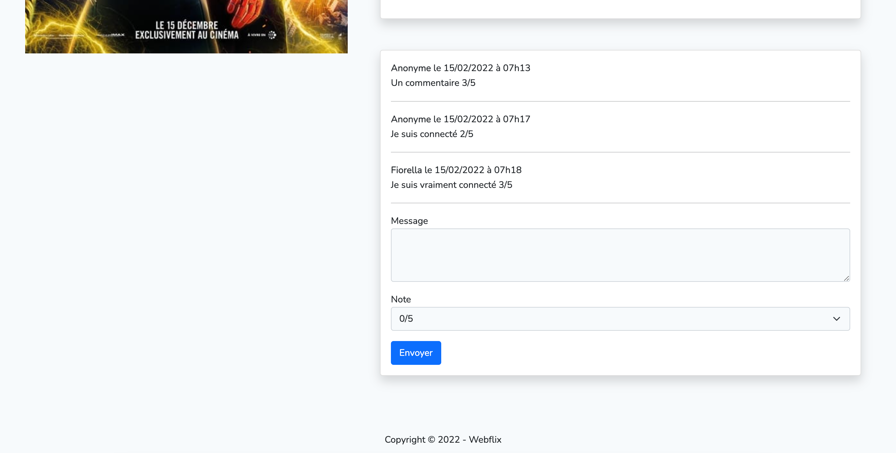

## Les filtres sur les films

Nous allons ajouter un système de filtres sur les films :

- Trier par nom ou date de sortie
- Filtrer par catégories

## (TP) : Les finitions de l'accueil

On ajoutera une liste aléatoire de films sur la page d'accueil.

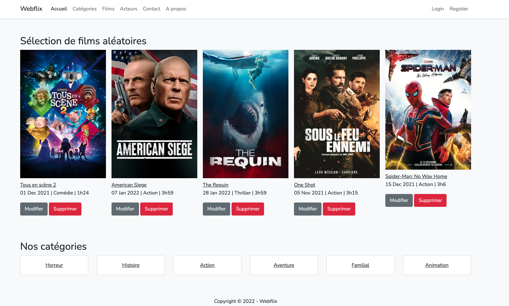

## Le profil utilisateur

On va ajouter la possibilité pour l'utilisateur de modifier son nom, son email ou d'ajouter un avatar.

## Une page de contact

On pourra créer une nouvelle page affichant un formulaire de contact. On demandera un email valide, un sujet (Tournage, Commande ou VOD) et un message d'au moins 10 caractères. On vérifiera les erreurs sur ce formulaire et on enverra un email si tout est correct. On pourra tester le résultat avec Maildev.

Pour envoyer un email avec Laravel, on peut consulter la [documentation](https://laravel.com/docs/9.x/mail).

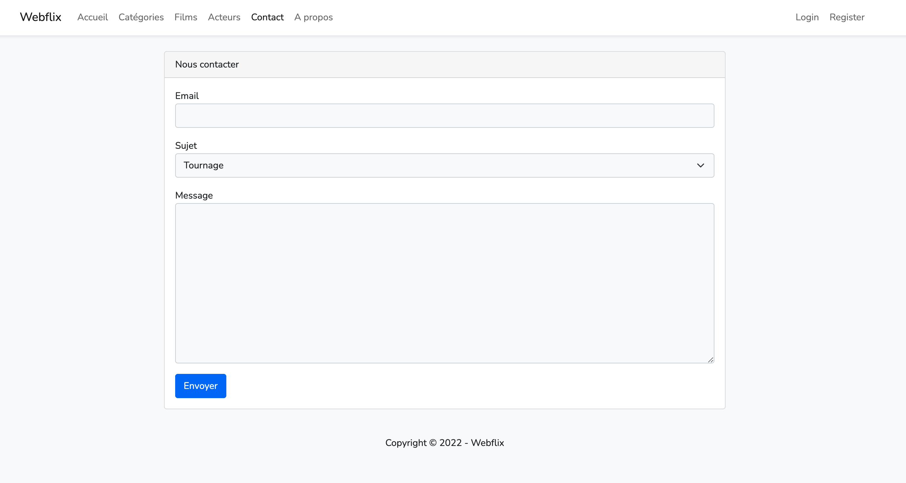

## TP : Lier les films aux acteurs

Si on a le temps...

## Newsletter en Ajax

Si nous avons le temps, on pourra essayer d'ajouter un formulaire d'inscription à une newsletter dans le footer. Ce formulaire devra être traité en Ajax afin qu'il n'y ait pas de rechargement de page.

## Middleware et layout admin

On va créer des routes nous permettant de gérer les films et les acteurs. Nous allons essayer de créer un layout pour nous faire un Back Office.

## Autorisations

- Le middleware nous permet de vérifier qu'un utilisateur est bien un administrateur et peut donc accéder à certaines pages.
- On va ajouter la possibilité pour n'importe quel utilisateur connecté de créer son propre film. Le film devra donc être lié à l'utilisateur connecté.
- Une fois ceci fait, on autorisera les propriétaires des films à modifier / supprimer les films qu'ils ont ajoutés.
